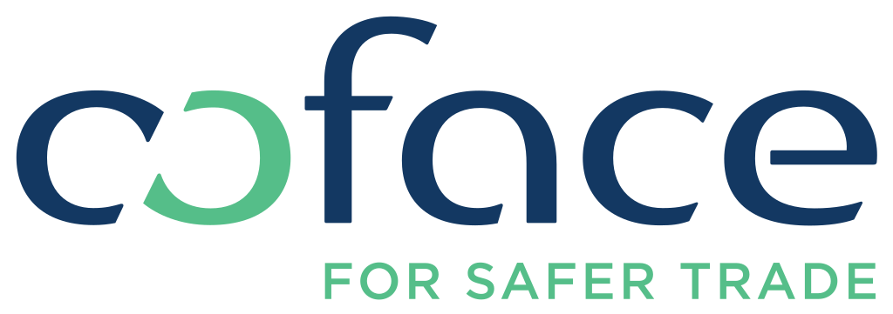

# Atos BDSS - Coface WS1 - lab #2 - OpenAPI Specification - CodeGen

Contenu de ce lab #2 :
1. Copier le fichier de spécification OpenAPI Specification que vous avez designé lors du Lab #1 ou utiliser la correction fournie.
2. Générer du NodeJS avec Swagger CodeGen.
3. Lancer le backend NodeJS automatiquement généré.
4. Visualiser la documentation graphique (Swagger UI).
5. Tester un appel surs l'API.