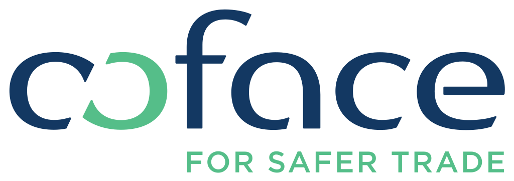

# Atos BDSS - Coface WS2 - Lab #1 - Securiser un backend NodeJS avec Let's encrypt.

Ce lab se place en continuité du WS1 Lab#2 qui à permis de générer automatiquement un backend NodeJS à partir d'un fichier de spécification OAS décrivant une API Météo. 

Contenu de ce lab #1 :
1. Installer Certbot (outil CLI pour Let's encrypt).
2. Générer un certificat avec Certbot (Let's encrypt).
3. Mettre à jour le backend NodeJS pour le faire passer de HTTP à HTTPS avec le certificat et la clé générés.
4. Lancer le backend sécurisé.